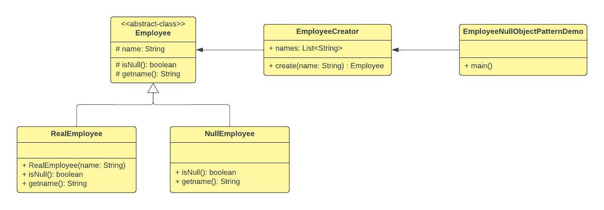

## Null Object Pattern

## 1. Null Object Pattern - Theory

```
The Null object pattern is a design pattern that simplifies the use of dependencies that can be 
undefined. This is achieved by using instances of a concrete class that implements a known 
interface, instead of null references. 

We create an abstract class specifying various operations to be done, concrete classes extending 
this class and a null object class providing do nothing implementation of this class and will be 
used seamlessly where we need to check null value.

- geeksforgeeks.org (https://www.geeksforgeeks.org/null-object-design-pattern/) -
```

- The value `null` is used to represent nothing. The notion of null is the notion of not having a
  value/ it's the notion of nothingness.`ex: String name = null;` (here the variable `name` of
  type `String` is not having a value/ null)


- The inventor of `null` is [Tony Hoare](https://en.wikipedia.org/wiki/Tony_Hoare), who's a British
  computer scientist. Speaking at a software conference in 2009, Tony Hoare apologized for inventing
  the null reference saying `I call it my billion-dollar mistake`.
  **Source:** (Wikipedia, https://en.wikipedia.org/wiki/Tony_Hoare)


- Essentially the point is that `null` is tricky, sometimes it's dangerous, sometimes super useful.
  Whenever we introduce `null`, it means we either have a thing or we don't. Which means there are
  necessarily two branches through the program. (ex: `Path 1` - what is the flow if the value is not
  null. `Path 2` - What is the flow if the value is null).


- So here the problem is conditional when it comes to dealing with `null` (problem is branching). As
  soon as something is nullable, we have to check whether it's null or not.


- Why do we need Null Object Pattern ? Because it addresses this problem. In Object-Oriented
  Programming, one of the key things we do is that we replace conditionals with polymorphism. One of
  the main reasons for why we use objects is because it gives us Polymorphism.


- It is very useful to have this Null Object Pattern because, it reminds us that whenever we see a
  null, there's a high chance that we can replace this null with a null object.


- Following is an example high level diagram for `Null Object Pattern` along with descriptions (
  included after the diagrams).

<div align="left" style="margin-bottom:20px;">
  
</div>

- `Client` : This class has a dependency that may or may not be required. Where no functionality is
  required in the dependency, it will execute the methods of a null object.


- `DependencyBase` : This abstract class is the base class for the various available dependencies
  that the `Client` may use. This is also the base class for the null object class. Where the base
  class provides no shared functionality, it may be replaced with an interface.


- `Dependency` : This class is a functional dependency that may be used by the Client.


- `NullObject` : This is the null object class that can be used as a dependency by the `Client`. It
  contains no functionality but implements all the members defined by the `DependencyBase` abstract
  class.


- **Source**: (geeksforgeeks.org, https://www.geeksforgeeks.org/null-object-design-pattern/)


- Following is the UML class diagram for the example implementation
  in `com.myorg.nop.implementation.employeeExample`.


<div align="left" style="margin-bottom:20px;">
  
</div>


## 2. References

1. https://www.youtube.com/watch?v=rQ7BzfRz7OY (Video: `Null Object Pattern – Design Patterns
   (ep 18)`, Author: `Christopher Okhravi`)
2. https://www.geeksforgeeks.org/null-object-design-pattern/
3. https://www.tutorialspoint.com/design_pattern/null_object_pattern.htm

