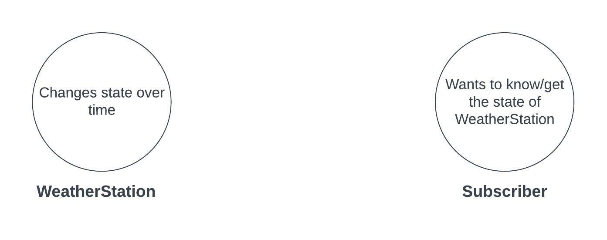
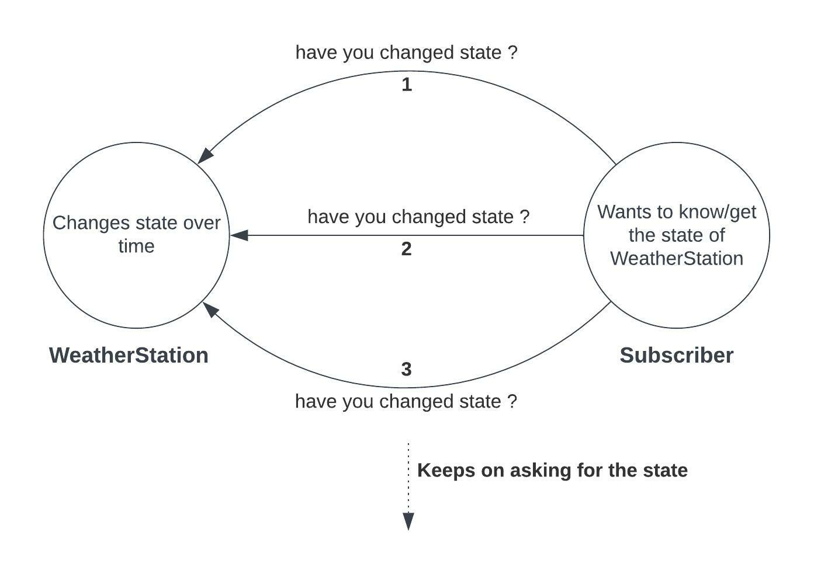
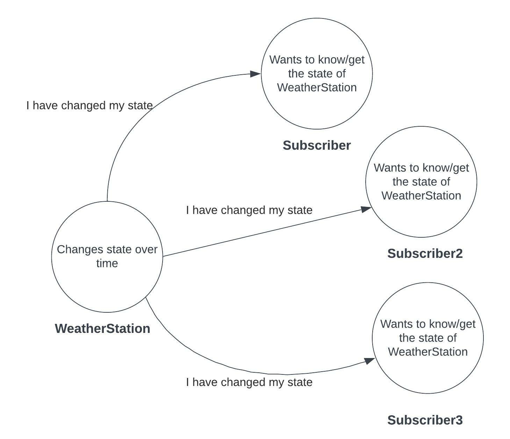
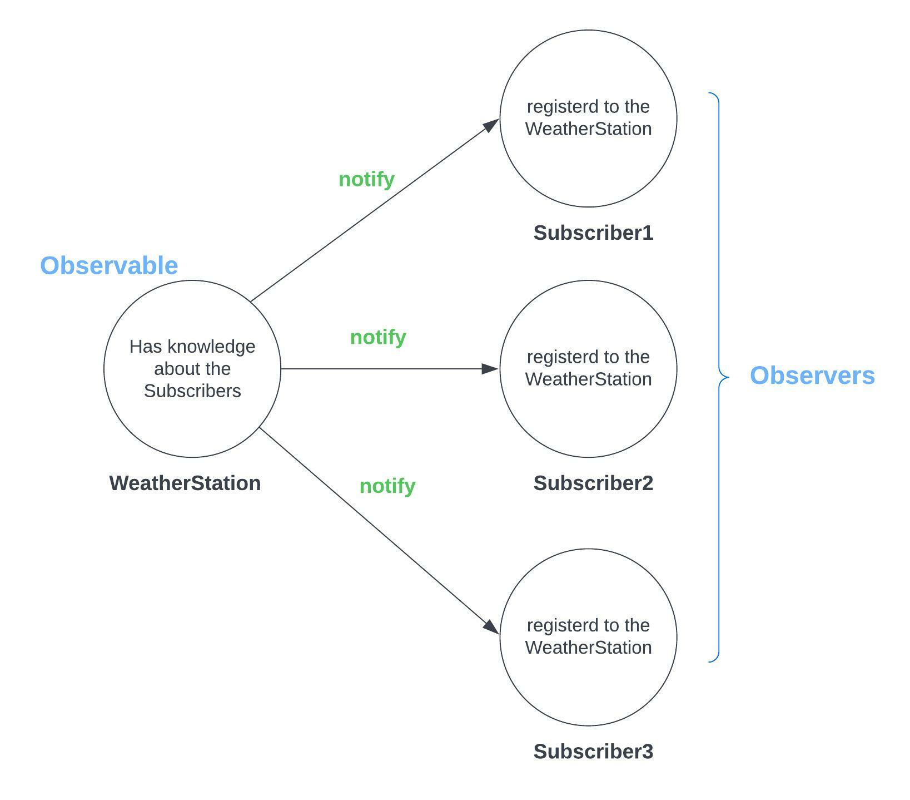

## Observer Pattern

## 1. Observer Pattern - Theory

```
The Observer Pattern defines a one to many dependency between objects, so that when one object 
changes state, all of its dependencies are notified and updated automatically 

- Head First Design Patterns -
```

- Imagine there are two objects/things as `WeatherStation` and `Subscriber`. Here `WeatherStation`
  changes its internal state over time (state may include different measurements of weather and
  relevant data).


- So the `Subscriber` wants to know about the state of `WeatherStation` for some reason. Assume that
  the `Subscriber` is some kind of dashboard/ or maybe a display that represents weather data. Think
  of it as a client that wants to know when the weather data is updated by the `WeatherStation`.

<div align="left" style="margin-bottom:20px;">
  
</div>

- The Observer pattern is essentially about `Push vs Poll`. it's about moving from `Poll`
  architecture to `Push` architecture.


- `Poll` : the `Subscriber` will ask regularly for the state of `WeatherStation` (Asks
  question, `have you changed/updated ?`)

<div align="left" style="margin-bottom:20px;">
  
</div>

- So in `Polling`, The `Subscriber` has to keep on asking for the state indefinitely, because
  the `Subscriber` doesn't know when the state of `WeatherStation` is changed. This is just a single
  object interested in the state of another. Imagine if we had a large number of `Subscriber`s who
  are polling for the state of `WhatherStation`. In that case, many `Subscriber`s will keep asking
  for the state of just a single object which is `WeatherStation`.


- Imagine this polling by many `Subscriber`s happening per each millisecond regardless of whether
  the `WeatherStation` changes it's state or not (asks even before we know if we actually have a new
  state or not). it will be an unnecessary usage of computing power and be costly as well.


- Instead of thar, The Observer Pattern helps us move into `Push` (Pushing).


- `Push` : Here, the `WeatherStation` will be responsible for telling all the `Subscriber`s when its
  state has changed. In other words, whenever the `WeatherStation` moves to another state, it is
  responsible to push the notification (to `Subscriber`s) of having the state changed. And in the
  essence, this is the observer pattern.

<div align="left" style="margin-bottom:20px;">
  
</div>

- Now we assume that `WeatherStation` has some knowledge about, who these `Subscriber`s are.
  Somehow, before we do this pushing all of the `Subscriber`s need to register to the Observable,
  which is `WeatherStation`.
    - `Observer/ Observers` ==> `Subscriber`s
    - `Observable` ==> `WeatherStation`
    - `Observable` is being observed by the `Observers` (`WeatherStation` is being observed
      by `Subscriber`s)
    - When the `Observable` is changed, the `Observers` are notified.
    - `Observable` is referred as `Subject` in some books and examples as well.

<div align="left" style="margin-bottom:20px;">
  
</div>

- The observer pattern defines `One to Many` relationship. In the above diagram, we can see there's
  one `Observable` and many `Observers` for example. So when the `Observable` changes its state, all
  the `Observers` are notified.

## 2. References

1. https://www.youtube.com/watch?v=_BpmfnqjgzQ (Video: `Observer Pattern – Design Patterns
   (ep 2)`, Author: `Christopher Okhravi`)
2. https://www.geeksforgeeks.org/observer-pattern-set-1-introduction/
3. https://www.geeksforgeeks.org/observer-pattern-set-2-implementation/?ref=lbp
4. https://www.javacodegeeks.com/2015/09/observer-design-pattern.html
