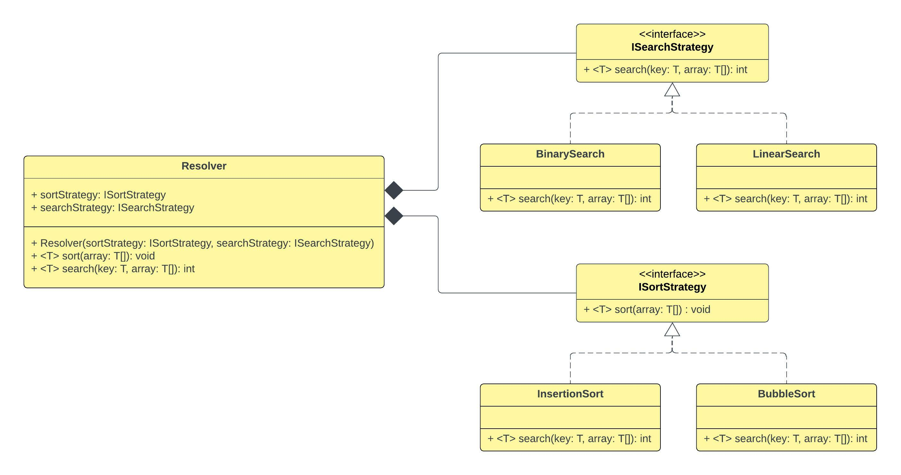

## Strategy Pattern

## 1. Strategy Pattern - Theory

```
The Strategy pattern defines a family of algorithms, encapsulates each one and makes them 
interchangeable. Strategy lets the algorithm vary independently from the clients that use it.

- Head First Design Patterns -
```

- If we think of it only in few words, it's about `using composition rather than interitance`. it's
  about `understanding that inheritance is not intended for code reuse`.


- In Strategy Pattern, you have a family/set of algorithms that you want to use where each and every
  algorithm is interchangeable. Consider you have `AlgorithmA`, `AlgorithmB` and `AlgorithmC`. So
  with Strategy Pattern you can kind of plug and play these algorithms.


- We decouple the algorithm from the one/client whi uses the algorithm, so for example we can vary
  between `AlgorithmA`, `AlgorithmB` and `AlgorithmC` (and so forth). The client/whoever is using
  these algorithms, does not have to vary if one of the algorithms varies. In other words, we mean
  that, if we want to change the content/ internal functionality of one of the algorithms, we don't
  necessarily have to change the client at the same time.


- So whoever is using one of the algorithms is not forced to change when we are changing one of the
  algorithms.


- Following is the UML class diagram for the example in `com.myorg.sp.practicals.algorithmsExample`.


<div align="left" style="margin-bottom:20px;">
  
</div>

## 2. References

1. https://www.youtube.com/watch?v=v9ejT8FO-7I (Video: `Strategy Pattern – Design Patterns
   (ep 1)`, Author: `Christopher Okhravi`)
2. https://www.geeksforgeeks.org/strategy-pattern-set-1/
3. https://www.geeksforgeeks.org/strategy-pattern-set-2/?ref=lbp
4. https://www.tutorialspoint.com/design_pattern/strategy_pattern.htm
