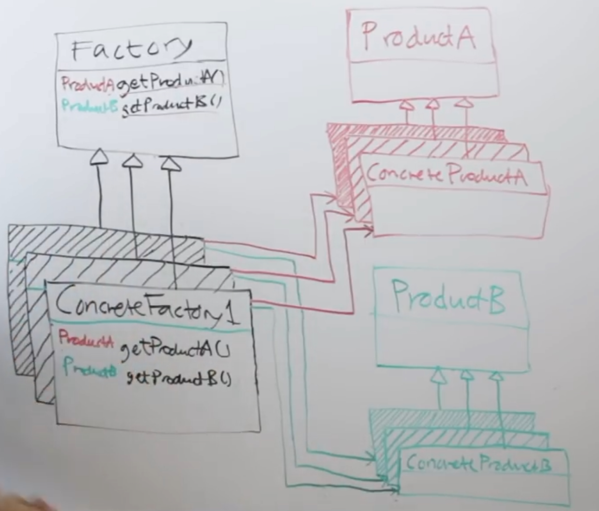

# Abstract Factory Pattern

## 1. Abstract Factory Pattern - Theory

```
The Abstract Factory pattern provides an interface for creating families of related or dependent
objects without specifying their concrete classes.

- Head First Design Patterns -
```

> Note : It's recommended to go through `Factory Method Pattern` before learning Abstract Factory
> Pattern

- If you have gone through the `Factory Method Pattern`, It'll be easy to understand
  `Abstract Factoy Pattern`. Because the `Abstract Factoy Pattern` is extremely similar to the
  `Factory Method Patter`. Actually in some sense, an Abstract Factory is a set of Factory Methods.
  Abstract Factory makes use of multiple Factory methods.


- So if you contrast this to Factory Method pattern, the single difference between these two is
  that the `Factory Method Pattern` constructs a single object, and the `Abstract Factory Pattern`
  constructs multiple objects.


- The important point however is that even though the `Abstract Factory Pattern` is technically very
  simple, if you think about it, it's kind of like dependency injection. If you start to look for
  places where you can apply this pattern (for example dependency injection), you actually start to
  realize that it is massively powerful. Like if you internalize the concepts and really understand
  it and make use of it in some strategic places, then your system becomes a lot more flexible.


- Following is the high level diagram for `Abstract Factory Method` pattern

<div align="left" style="margin-bottom:20px;">
  
  <p><b>Source/Author:</b>(Christopher Okhravi, https://www.youtube.com/watch?v=v-GiuMmsXj4)</p>
</div>

- Have a loot at the diagram above. The point is that, you have 2 types which are `ProductA`
  and `ProductB`, and you want to create both the types with the `Factory`, but not all the
  concretions of `ProductA` make sense in conjunction with all concretions of `ProductB`.


- So you can't just let the users of your code wildly create different instance in combination of
  types of `ProductA` and `ProductB`. (For example `ProductA1` may not make sense in association
  with `ProductB3`, but it could make sense in conjunction with `ProductB1` instead)


- Instead, you provide them with number of `ConcreteFactory`s that creates a family of these
  products together. For Example assume `ProductB` and `ProductA` make sense together, so with
  that `ConcreteFactory1`, you can then give that `ConcreteFactory1` to the user and that users will
  be able to create both `ProductA`s and `ProductB`s and be sure that the `ProductA`s make sense in
  conjunction with `ProductB`s and vise versa.


- So if you think about dependency injection, if you think about providing someone with a Factory,
  the point is that you are able to give some piece of code/ a particular factory, you are able to
  inject a particular Factory into a particular location of your code. So you have a method where
  you want to create a Product but instead of using `new` to instantiate that Product, you pass a
  Factory/ an instance of a Factory/ a concrete Factory into that place, and then you call
  getProduct() on that particular Factory, and then you get a Product instance back.


- We are doing exactly the same thing here (just like dependency injection) . But we are passing a
  ConcreteFactory that can create multiple Products. So when we are coupling to the Factory, we are
  not coupling to a Factory that only has a single factory method, but we are coupling to an
  AbstractFactory that has multiple factory methods.


## 2. Side Nodes:

## 3. References:

1. https://www.youtube.com/watch?v=v-GiuMmsXj4 (Video: `Abstract Factory Pattern – Design Patterns
   (ep 5)`, Author: `Christopher Okhravi`)
2. https://www.geeksforgeeks.org/abstract-factory-pattern/

