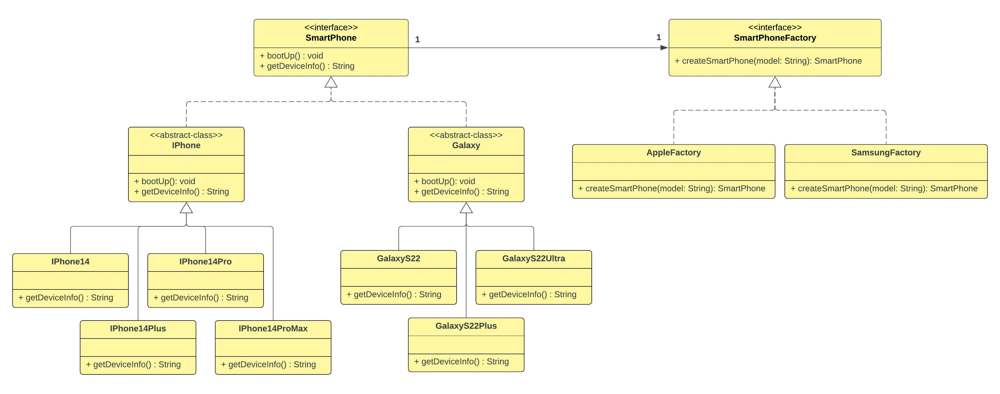

# Factory Method Pattern

## 1. Factory Method Pattern - Theory

```
The Factory Method Pattern defines an interface for creating an object, but lets subclasses decide
which class to instantiate. Factory Method lets the class differ instantiation to subclasses.

- Head First Design Patterns -
```

> **NOTE**: Heads First Design Pattern Books talks about 3 versions of the factory pattern 
> 1. ~~Simple Factory~~ - The book states that this is not actually a design pattern
> 2. Factory Method (This is our focus here)
> 3. Abstract Factory (This is discussed separately in `abstract-factory-pattern` module)


- `Factory Method` design pattern comes under `Creational Design Patterns`.


- In factory method pattern, instantiation logic of objects can be encapsulated/built into/coded into
  what we refer to as a Factory. This factory is responsible to hold/ keep the business logic
  for creation of some particular shared type. Assume we have an interface called `Animal` and
  some implementations for it as `Dog`, `Cat`, and `Dolphin`. There the `Animal` interface is the 
  shared type. We can have a factory class called `AnimalFactory` in order to keep the instantiation 
  logic for `Animal` types such as `Dog`, `Cat` and `Dolphin`.


- So we have a factory (ex: `AnimalFactory`) that is responsible for a particular creation mechanism
  , a particular way of constructing `Animal`s. So if we have 2 factory subtypes (ex: `RandomAnimalFactory`,
  `SpecificAnimalFactory`, those are 2 ways of creating `Animal`s. Both of the factories create the
  same thing/ same `Animal` types. But `they create them in different ways` and/or `they create
  different subtypes`.


- Why do we need the factory method pattern ? why do we need such a thing/ concept called factory ?
  - When you are about to instantiate something, let's encapsulate that instantiation so that we can
    make it  uniform across all places. We can use the factory whenever we want to instantiate some 
    object. So that the factory is responsible for instantiating it appropriately.


- It might seem a little silly to create a wrapper around the keyword `new`, because if the
  difference is specifying `Animal a1 = new Dog()` or calling `createAnimal("Dog")` on `AnimalFactory`
  , then it seems like we are just substituting one line for the other in order to 
  instantiate an `Animal` type. We might start to wonder what the benefit is.


- Think about it from these two perspectives.
    - `Fact 1` -  It's possible that the instantiation can actually be very complex. In other words, 
      it's possible that in order to instantiate an `Animal` type, we might need computation. 
      We need some kind of business logic to determine what parameters we want to pass to that 
      particular `Animal` type and maybe which `Animal` type we want to construct` depending on the
      conditions.
  
    - `Fact 2` -  It's also about polymorphism. If we have a factory that wraps our construction,
      and if that factory is an instance, then we can swap that at runtime, we can swap that 
      instance, for an instance of another factory. (When we have multiple type of factories)
      

## 2. Side Nodes:

- Following is the UML class diagram for the example in `com.myorg.fmp.implementation.smartPhoneExamlpe`
package

<div align="left" style="margin-bottom:50px;">
  
</div>


## 3. References:

1. https://www.youtube.com/watch?v=EcFVTgRHJLM (Video: `Facotory Method Pattern – Design Patterns 
(ep 4)`, Author: `Christopher Okhravi`)
2. https://www.geeksforgeeks.org/factory-method-design-pattern-in-java/
