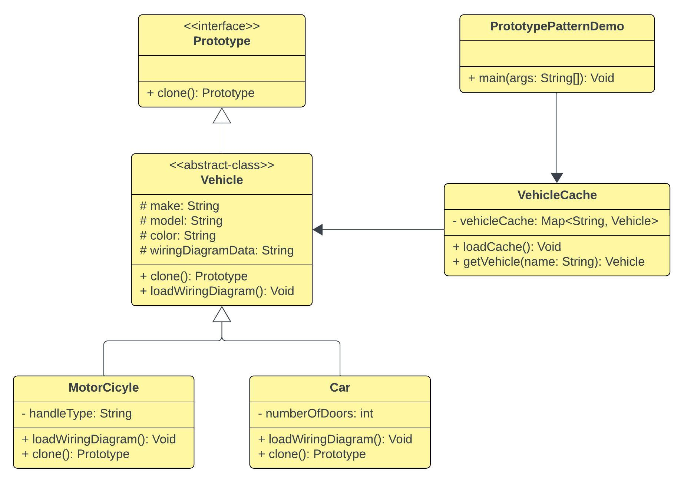

# Prototype Pattern

## 1. Prototype Pattern - Theory

```
The Prototype Pattern allows you to make new instances by copying existing instances. (In Java this 
typically means using the clone() method, or de-serialization when you need deep copies.) 

A key aspect of this pattern is that the client code can make new instances without knowing which
specific class is being instantiated.

- Heads First Design Patterns -
```

- Use `Prototype Pattern` when creating an instance of a given class is either expensive or
  complicated than copying an existing one.


- Prototype should be considered when a system must create new objects of many types in a
  complex class hierarchy.


- By understanding and implementing the Prototype Design Pattern, you can efficiently manage object
  creation and avoid the overhead associated with complex instantiation processes.

### 1.1 When to use Prototype Pattern ?

- When the cost of creating a new object is high.


- When an object has numerous configurations and initializing them takes time.


- When the composition or structure of the object should not be hard-coded.

### 1.2 Prototype Pattern Benefits:

- Reduces the cost of creating objects. Which means that, in some circumstances, copying an object
  can be more efficient than creating a new object.


- Hides the complexity of creating an object from the client.


- Simplifies object creation. Provides the option for the client to create objects without knowing
  their exact class


- Allows for dynamic addition and removal of objects at runtime.


### 1.3 Prototype Pattern Drawbacks:

- Complexity: Implementing the clone() method can be complex, specially when dealing with objects
  that have complex internal structures or references to other objects.


- Care must be taken to ensure the correct type of copy (deep or shallow) is implemented, depending
  on the application's requirements.


<div align="center">
  
  <p>(This diagram excludes getters, setters and constructors)</p>
</div>


## 2. References:

- https://github.com/geekific-official/geekific-youtube/tree/main/design-patterns/creational-prototype/src/main/java/com/youtube/geekific


- https://www.youtube.com/watch?v=rriiXRdc0HQ (Note - Video language is Hindi)
