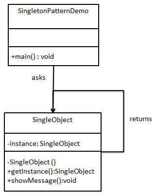

# Singleton Pattern

## 1. Singleton Pattern - Theory

```
The Singleton pattern ensures that a class has only one instance and provides a global point of
access to it.

- Head First Design Patterns -
```

- Singleton pattern is coming under creational design patterns.


- From the initialization perspective, there are 2 main variations of singleton pattern
  1. `Eager Initialization` (Can be either thread safe or non-thread safe)
  2. `Lazy initialization` (Can be either thread safe or non-thread safe)


- Singleton pattern can make testing (i.g unit testing) more difficult, because whoever is 
requesting for the singleton object, will definitely get the same global single instance. But in 
testing, we might want to mock that, we might want to compare the different states of a singleton
instance. We are not able to have a different objects from a single instance at all.


- It is completely fine to have a single instance of some class within the application, but it might 
not always be a good idea to make it impossible to create a second instance of a particular instance.


- But the singleton pattern is designed with the intention of making it impossible to create a 
second instance.


- Since we are making the Singleton class constructor private (private no-arg constructor), it 
cannot be instantiated using `new` keyword at all. Instead, it provides a public static method 
called `getInstance()` in order to instantiate the singleton object. And it's the only way that 
it is possible to access the singleton instance.


- When implementing a singleton class, we should take special care of `cloning`, `serialization`,
`reflections` in order to restrict creating a second instance.

<div align="center">
  
  <p>Source for above figure: (tutorialspoint.com, 2022, https://www.tutorialspoint.com/design_pattern/singleton_pattern.htm) </p>
</div>

## 2. References:

1. https://www.youtube.com/watch?v=hUE_j6q0LTQ (Video: `Singleton Pattern – Design Patterns 
(ep 6)`, Author: `Christopher Okhravi`)
2. https://www.geeksforgeeks.org/singleton-design-pattern-introduction/
3. https://www.geeksforgeeks.org/singleton-design-pattern/?ref=lbp
4. https://www.tutorialspoint.com/design_pattern/singleton_pattern.htm
5. https://www.geeksforgeeks.org/prevent-singleton-pattern-reflection-serialization-cloning/#:~:text=Serialization%20is%20used%20to%20convert,hence%20break%20the%20singleton%20pattern.
