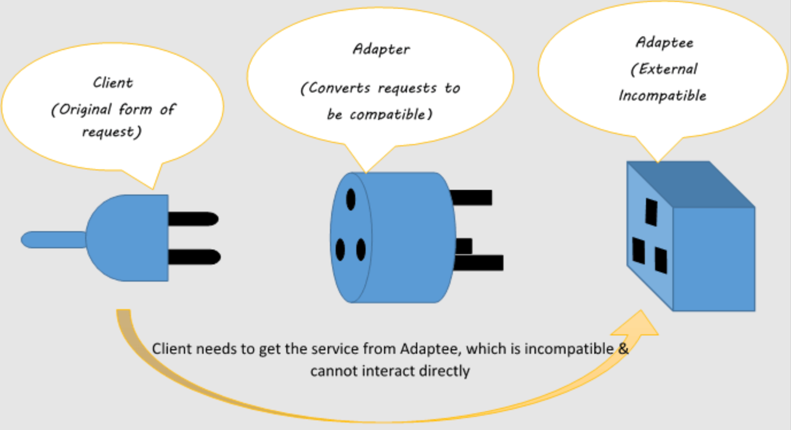

# Adapter Pattern

## Some Important Points

There are 4 design patterns that can lead us to confusion easily and those are,

1. Adapter Pattern
2. Facade Pattern
3. Proxy pattern
4. Decorator Pattern


A quick hint about what the differences of above patterns are,

- Adapter pattern is about making two interfaces that are not compatible, compatible. (Makes
interfaces compatible)
 

- Facade pattern is about taking a bunch of complex interactions and creating a facade that we can
use, instead of having to deal with all those internal complexities/ complex interactions directly.
(Hides complex logic/internal complexity)


- Proxy pattern is way of placing a proxy between something that we want to call. Where you want to
call a particular thing, but instead of calling that thing we call the proxy who calls that
particular thing. The reasons for this could be stuff like security, caching for example. 
(Intercepts a call and thus controls access to the underlying object)


- Decorator pattern is a way of adding behaviour to some particular object without actually opening
up and changing that object. (Adds behaviour to some particular object, the object that it is 
declarating)


## 1. Adapter Pattern Introduction

```
The Adapter Pattern converts the inteface of a class into another interface that the client expects.
(Remember here, we are saying "interface" in the sense of the contract)

Adapter lets classes work together that couldn't otherwise because of incompatible interfaces.

- Head First Design Patterns -
```

- Adapter pattern is coming under structural design patterns.


- Adapter pattern is also known as a `Wrapper`. (What adapter does is,it wraps something so that we 
can adapt it to a different interface) 


- Here what we mean by the `Client` is the user of the pattern, the piece of code that uses the
  pattern.


- The intention is to not changing the underlying behaviour. 


- You adapt something, you have an adapter that you stick in between two things, but the intention 
is `not to add behaviour`, `not to remove behaviour` and `not to alter behaviour`. 


- And the intention is really `to somewhat blindly just pass on the request`.


- The point is that you have two different types of signatures/ interfaces and the interfaces don't 
connect. They are not interoperable. So the intention is to make them interoperable. 
(intention is to not adding additional behaviour)

<div align="center" style="margin-bottom:50px;">
  
  <p>Source for above figure: (Mishra N, 2020, https://itsnishantmishra.medium.com/adapter-design-pattern-c-1cc8327f45d5) </p>
</div>

<div align="center">
  
</div>

- The `Client` (the user of the code) has something of the type `ITarget`.


- This `ITarget` has a method called `request()` and that method `request()` is the standard that
we used to using.


- But, because we want to use something that has a completely different interface (the `Adaptee`),
we can't just call `request()` because `Adaptee` does not have a method called `request()`. Instead 
`Adaptee` has a method called `specificRequest()`.


- So what we do is, we invoke the `request()` method, but we invoke it on an `Adapter`.


- The `Adapter` follows the signature that we used to using (follows the signature `request()`).
So we can call `request()` and then count on the adapter to call the `Adaptee`, because the `Adapter`
has an `Adaptee`. It is responsible for delegating the `request()` down to the `Adaptee`.


- Then the `Adaptee` can perform that `specificRequest()` that we were originally interested in.


- Here the example scenario is that the `Client` wants to call the method `specialRequest()` but it
  wants to do so by using the signature `request()`. In order to be able to achieve that, in order for
  the `Client` to be able to call the method using the signature `request()` even though the actual
  underlying signature is `specificRequest()`, what we do is, we stick the `Adapter` in between.


- So the `Client` is coupled to an interface called `ITarget` that follows this particular signature
`request()` that it will want to follow.


- And we have this concrete implementation of `ITarget` interface, which is the `Adapter` that
follows the implementation for `request()`. And when the implemented method `request()` is called,
then the `specificRequest()` of `Adaptee` will be invoked.


## 2. References:

1. https://www.youtube.com/watch?v=2PKQtcJjYvc&t=307s (Video: `Adapter Pattern – Design Patterns 
(ep 6)`, Author: `Christopher Okhravi`)
2. https://www.geeksforgeeks.org/adapter-pattern/
3. https://www.tutorialspoint.com/design_pattern/adapter_pattern.htm
4. https://itsnishantmishra.medium.com/adapter-design-pattern-c-1cc8327f45d5
