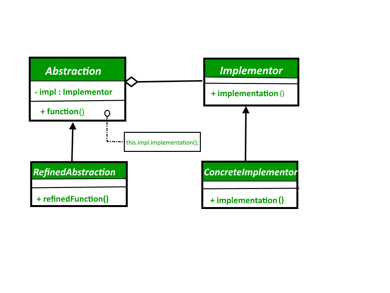
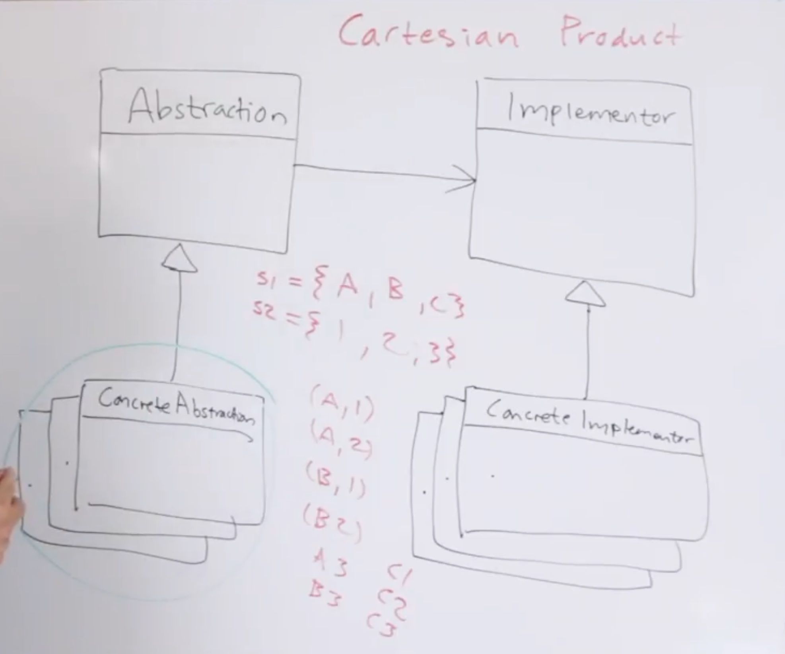
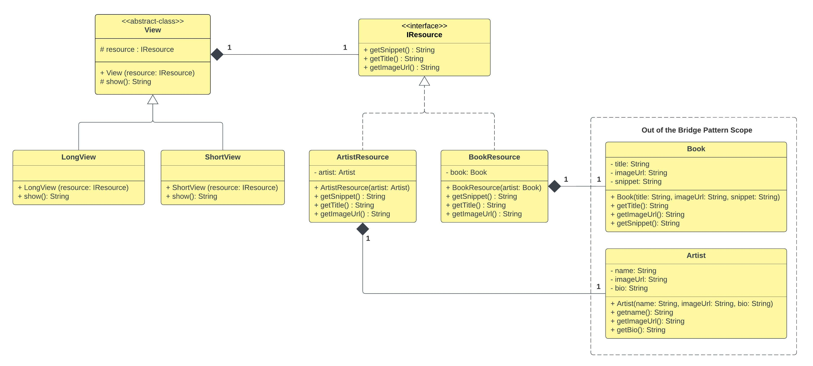
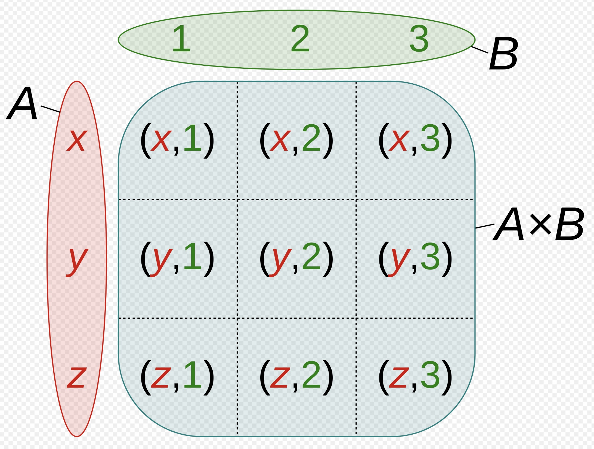

# Bridge Pattern

## 1. Bridge Pattern - Theory

```
The intent of the Bridge Pattern is to decouple an abstraction from its implementation so that the
two can vary independently.

- Design Patterns - Elements of Reusable Object Oriented Software -
```

- We can think of this as decoupling an interaction, more like adapter pattern, because in adapter
pattern, we stick an adapter in between something (in between two interfaces that are not 
compatible) so that we can vary two interfaces independently. Generally it seems that the adapter
pattern is usually added exposed/ added after the fact whereas the bridge pattern is applied
precociously, it's applied before to allow us the flexibility for the future.


- This means we apply adapters when we have a problem, but we use bridge pattern to avoid that kind
of problem before it arises. It's more of the interaction being the key.


- Following is the high level UML class diagram for Bridge Pattern.


<div align="left">
    
    <p>Source : (GeeksforGeeks, 2022, https://www.geeksforgeeks.org/bridge-design-pattern/)</p>
</div>


- There are two main parts of the Bridge Pattern.
  1. Abstraction
  2. Implementation


- This is a design mechanism that encapsulates an implementation class inside an interface class.


- The bridge pattern allows the Abstraction and the Implementation to be developed


- The `Abstraction` is an interface or an abstract class and the `Implementor` is also an
interface or an abstract class.


- The `Abstraction` contains a reference to the `Implementer`. Children of the `Abstraction` are
referred to as `RefinedAbstractions`, and children of the `Implementor` are `ConcreteImplementor`s.


-  We can have any number of `RefinedAbastractions` and `ConcreteImplementor`s.


- Since we can change the reference to the `Implementor` in the `Abstraction`, we are able to
  change the `Abstractions`'s `Implementor` at runtime. Changes to the `Implementor` do not
  affect client code.


- It increases the loose coupling between class Abstraction, and it's implementation.


- So this is basically a paring of `RefinedAbstraction`s with `ConcreteImplementor`s. Just like we
are doing in `Cartesian Product`. (Please refer **[Side Notes](#2-side-notes)** section below 
for more clarifications)

```
Example 1:
    s1 = { A, B }
    s2 = { 1, 2 }

    Cartesian Product: (number of ordered pairs = 2 x 2 = 4)
        { A, 1 }
        { A, 2 }
        { B, 1 }
        { B, 2 }

Example 2:
    s1 = { A, B, C }
    s2 = { 1, 2, 3 }

    Cartesian Product: (number of ordered pairs = 3 x 3 = 9)
        { A, 1 }
        { A, 2 }
        { A, 3 }
        { B, 1 }
        { B, 2 }
        { B, 3 }
        { C, 1 }
        { C, 2 }
        { C, 3 }

* Here we can see, as we add more elements to the sets, the number of elements in the Cartesian
  Product exponentially increases.
```

- With respect to Cartesian product, consider `RefinedAbstraction` as `Set 1` and 
`ConcreteImplementation` as `Set 2`. So we want to pair up any of the `RefinedAbstraction`s with 
any of the `ConcreteImplementation`s.


- Assume we have 10 `RefinedAbstraction`s and `ConcreteImplementation`s, so the Cartesian product
  is going to 100. (10 x 10 = 100 ordered pairs). But we do not have to have 100 classes side by
  side for this. We just need to have 10 `RefinedAbstraction`s and 10 `ConcreteImplementation`s and
  that's enough to compose 100 combinations. That's the key point.


<div align="left">
    
    <p>
        Please note that ConcreteAbstraction in diagram is the same as RefinedAbstraction.<br/>
        ConcreteAbstraction = RefinedAbstraction
    </p>
</div>


- Following diagram refers to the code implementation included in `com.myorg.bp.implementation`
package.


<div align="left">
    
</div>


## 2. Side Notes

1. `Cartesian Product`

- Simply, the term cartesian product is used to describe a set that derived from two other sets.


- The Cartesian product of two sets, `A` and `B`, denoted by `A x B`, is the set of all ordered 
pairs`(a,b)` , where `a` is an element of `A` and `b` is an element of `B`.

    ``A x B = {(a,b) | a &isin; A &#x22c0; b &isin; B}``

<div align="left">
    
    <p>
        Cartesian Product of A x B of the sets where A = {x, y, z} and B = {1, 2, 3}<br/>
        Source : (Wikipedia, 2022, https://en.wikipedia.org/wiki/Cartesian_product)
    </p>
</div>


## 3. References

1. https://www.youtube.com/watch?v=F1YQ7YRjttI (Video: `Bridge Pattern – Design Patterns
   (ep 11)`, Author: `Christopher Okhravi`)
2. https://www.geeksforgeeks.org/bridge-design-pattern/
3. https://www.tutorialspoint.com/design_pattern/bridge_pattern.htm
4. https://refactoring.guru/design-patterns/bridge
5. https://en.wikipedia.org/wiki/Cartesian_product
6. https://www.sciencedirect.com/topics/computer-science/cartesian-product
