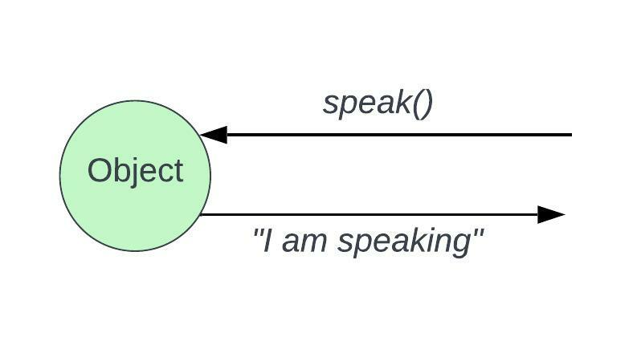
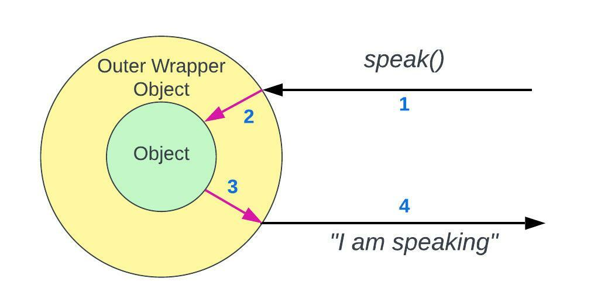
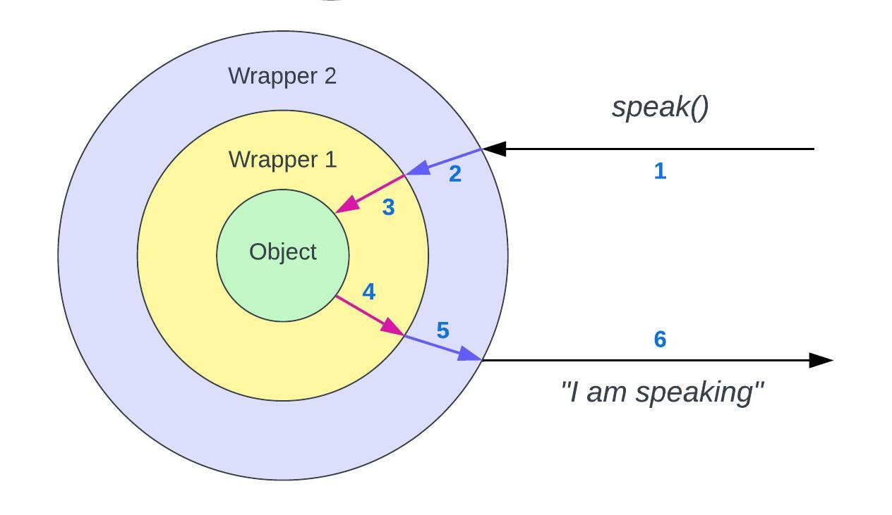
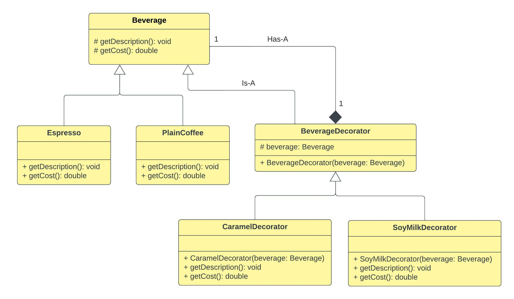
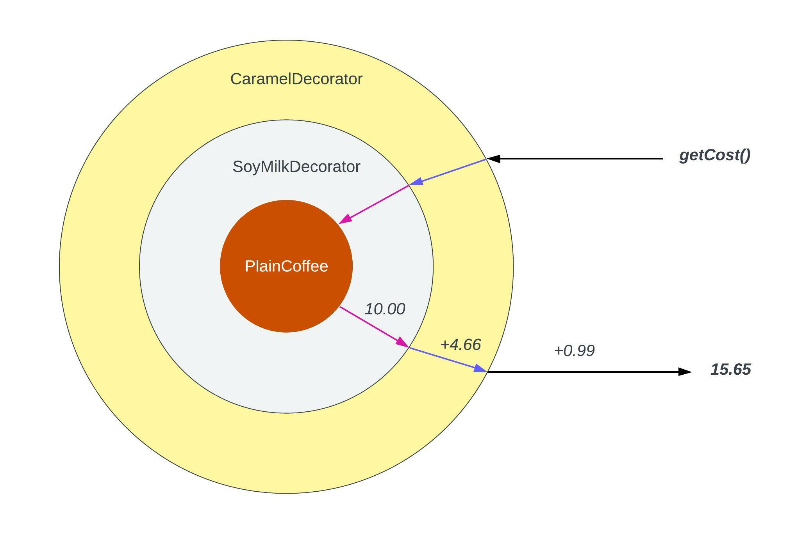

# Decorator Pattern

## 1. Decorator Pattern - Theory

```
The decorator pattern attaches additional responsibilities to an object dynamically.
Decorators provide a flexible alternative to sub classing or extending functionality.

- Head First Design Patterns -
```

> **NOTE**: the examples for Decorator pattern that can be found in `Head First Design Patterns` book may
> not be really suitable for decorator pattern. In other words, it's a good example for illustrating
> how decorator pattern works and how you sort of syntactically arrange the pieces 
> together. But it should not be taken literally most of the time. 

- Imagine you are having an object, you can send a message to that objet by calling `speak()`
method for example, and the object will respond with a String (Ex: `"I am speaking"`).


- The decorator pattern is a way of saying that, if you want to change the response
from above object that is returned/ if you want to change the behaviour of this method,
you could actually do that at runtime without changing the contents of that particular 
object you have.


<div align="left">
    
</div>


- So that you change it at runtime but not at compile time. Therefore, you can simply think 
of this as, changing the behaviour of the object without actually rewriting the contents
of it. (Without actually opening up the class and changing the contents of that file)

   
-  So with decorator pattern, what we do is, instead of changing the object contents, we 
actually wrap that object in another object. In that case, when we send the message 
`speak()`, we send it to the outer object/wrapper which will then send the message to the
inner object. After that, the inner object will send the message to the outer object/ 
wrapper, and the outer object/ wrapper will send the response back to us. Take a look at
following diagram.


<div align="left">
    
</div>


- Likewise, we can add nested wrapper objects around existing wrappers if we want to do so.
Messages will reach the inner object after going through each wrapper, and we'll
get the response from the inner object after the response message come through each outer
wrapper.( Basically we have an objects which wraps another object which wraps another 
object, and it goes on likewise) 


<div align="left">
    
</div>


- By referring the above figure, the point here is that, we have the inner object/ object in the 
middle, and we'll refer to it as the component. The `Wrapper 1` which wraps the component is a
decorator, and the `Wrapper 2` which is wrapping the decorator `Wrapper 1` is also a decorator.


- If we think about a single one of these decorators (ex: `Wrapper 1`), the Decorator `Has-A` 
component and `Is-A` component. These two decorators that we have (`Wrapper 1` and `Wrapper 2`), 
actually behave from the outside/ from the interface standpoint, and they are, as in `Is-A`, of the
same type as inner object. In other words, they are exchangeable.


-  Whenever we have this inner object, we could use `Wrapper 1`, or instead of we could use 
`Wrapper 2`. We wrap the original object, and then we can use a wrapper and pass that around as if
it was one of the original objects.


- The decorator is of the same type as the original object, because we want to be able to treat it
as if it was one of these original objects. And the `Has-A` portion, the fact that it has one of 
these original object types, is because we want to be able to send the message downwards and then
return upwards.


- In terms of the definition of the decorator pattern (which is on the top in this documentation),
we have the original object which is originally doing something, but now using decorator pattern,
we attach additional responsibilities. Outer `Wrapper 1` attaches some sort of responsibilities and 
`Wrapper 2` attaches some other responsibilities. This happens dynamically means that we can
attach different responsibilities at runtime but not at compile time.


- With `Decorators provide a flexible alternative to subclassing` said, think about that classical
saying that `inheritance is not for code reuse, inheritance is not for sharing behaviour`. So the decorator
it is a way of using composition rather than using inheritance in order to share behaviour. In our
diagram with multiple wrappers (`Wrapper 1`, `Wrapper 2`), we use inheritance/ `Is-A`, but only to
make the decorator/ wrapper behave as it was one of the original objects/inner objects. There, we
are not using inheritance to share behaviour, we use composition ot share behaviour.


- We can also think of it in this way; If we define subclass `A`, subclass `B` and subclass `C`,
then we only have `A`, `B`, `C`. We can somehow compose a new class at runtime which is a composition
of `A` and `B`, or `B` and `C`. But with decorators, we are defining the `DecoratorA`, `DecoratorB`
and `DecoratorC` and we can actually compose/ use both the `DecoratorA`, `DecoratorB` at
the same time, so it's more flexible.

## 2. Side Notes

1. Following is the UML class diagram for the example (Coffee decorators example) in 
com.myorg.dp.implementation.beverageExample` package.


<div align="left">
    
</div>

2. This is some example code and corresponding multiple decorators diagram in `BeverageDecoratorDemo`
class within the same package.

- Code: 
```
Beverage plainCoffeeWithCaramelAndSoyMilk = new CaramelDecorator(new SoyMilkDecorator(new PlainCoffee()));
plainCoffeeWithCaramelAndSoyMilk.getDescription();
System.out.println(plainCoffeeWithCaramelAndSoyMilk.getCost() + "\n");
```

- Output:
```
Plain Coffee
Soy Milk Included
Caramel Included
15.65
```


- Sample diagram for representing the decorators and `getCost()` method call:

<div align="left">
    
</div>

## 3. References

1. https://www.youtube.com/watch?v=GCraGHx6gso (Video: `Decorator Pattern – Design Patterns
   (ep 3)`, Author: `Christopher Okhravi`)

