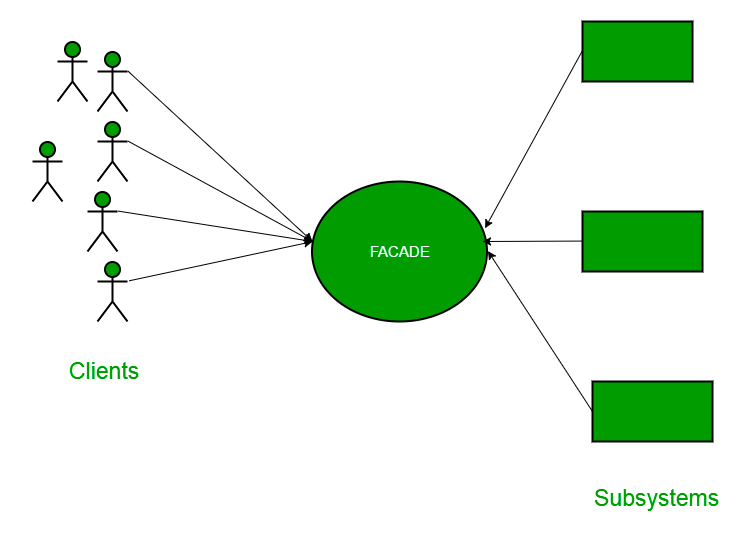
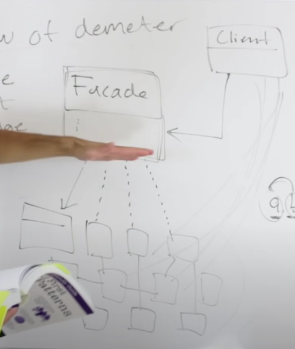

# Facade Pattern

## 1. Facade Pattern - Theory

```
The facade pattern provides a unified interface to a set of interfaces in a sub system.
Facade defineds a higher level interface that makes the sub system easier to use. 

- Head First Design Patterns -
```
- Facade pattern is coming under structural design patterns.


- Considering a real world example, as the name suggests, it means the face of a building. The people 
walking by on the road can only see the glass face/ outer face of the building. They do not know
anything about the internal complexities such as plumbing, wiring, and etc. (internal structure).
It hides all the complexities of the building and display a nice friendly face.


- Considering a programmatic example, in Java, the interface JDBC can be called a facade because, we
as users or clients create the connection using `java.sql.Connection` interface, the implementation
of which we are not concerned about. The internal complexity is left to the vendor of driver.
(MySQL driver, Postgres Driver etc.)


- In summary, facade pattern hides the complexities of the system and provides an interface to the 
client using which the client can access the system. This type of design pattern comes under 
structural pattern as this pattern adds an interface to existing system to hide its complexities.


- This pattern involves a single class which provides simplified methods required by client and delegates calls to methods of existing system classes.

<div align="center">
    
</div>

<div align="center">
    
    <p><b>Source/Author:</b>(Christopher Okhravi, https://www.youtube.com/watch?v=K4FkHVO5iac)</p>
</div>

## 2. References:

1. https://www.youtube.com/watch?v=K4FkHVO5iac (Video: `Facade Pattern – Design Patterns (ep 9)`, Author: `Christopher Okhravi`)
2. https://www.geeksforgeeks.org/facade-design-pattern-introduction/
3. https://www.tutorialspoint.com/design_pattern/facade_pattern.htm
