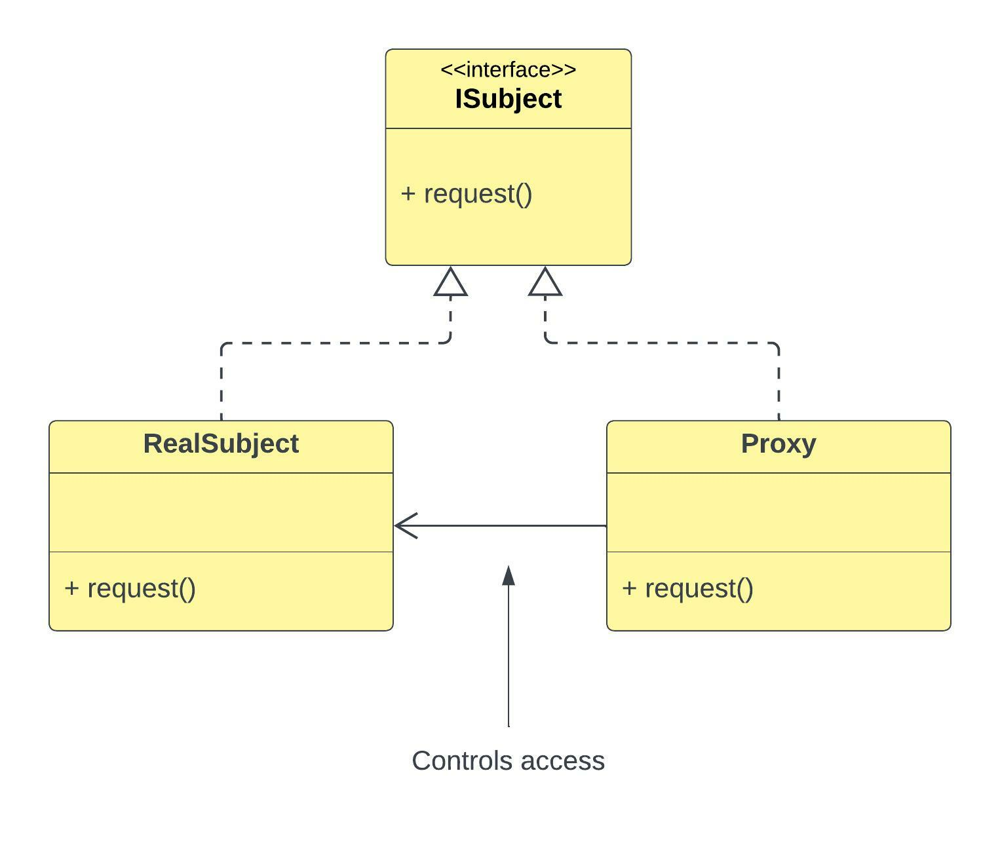

# Proxy Pattern

## 1. Proxy Pattern Introduction

```
The proxy pattern provides a surrogate or placeholder for another object in order to control access to it.

- Head First Design Patterns -
```

 - This is just a way of saying that you have an object that you want to get access to/ that you want
to invoke methods on/ that you want to somehow interact with, but instead of being allowed to
interact with that thing/object, you interact with the proxy who interacts with that particular
thing/object.


- So it's another way of introducing another level of indirection instead of calling the thing you 
want to call directly, you call a proxy that calls the thing that you want to call.
 
  
- With proxy pattern, we are trying to solve a specific set of problems that are all access related.


- So you put a proxy in front of something that you want  to allow people to access. As you have the
proxy, you can control access to that thing.


- One of the key things of the proxy pattern is that the proxy pattern looks like the remote
  resource/ the proxy pattern looks like the thing it's proxying. So if you think about adapter 
  pattern for example, adapter pattern adapts to a different interface. Adapter pattern lets you
  say that you want to access a thing that has some particular interface, but you have a 
  different interface, and you want to access it via your own/different interface.

  
- Proxy pattern however is simply a way of controlling access, so it does not change the interface.
  You have something that you want to interact with that has some particular interface, and you 
  don't want to change the interface, you simply want to intercept the accessing of that thing that
  you want to access for some reason such as security, caching or etc.

- There are 3 ways/styles/intents of proxy patterns according to `Head First Design Patterns` book.
These 3 ways say that a proxy can be either,
   1. `Remote Proxy`
      - A remote proxy is suggested to be used when you want to access a resource that is remote.
        We mean something that could exist in a different server/namespace/code project. 
      
      - So, imagine somehow you have to leave the safe boundary of your application out into the
        outside world/environment inorder to retrieve some information back. 
      
      - That interaction (sort of transaction) could be wrapped in a proxy so your proxy is
        responsible for this interaction/ interacting with the remote resource and giving you
        back the resources/things that you need.
      
      - Think of it like that the proxy is something that would interact with a remote resource but
        immediately return you a promise. So it returns you a promise that promises to evaluate to\
        the concrete resource that you are looking for after a while.
      
      - But instead of scattering this HTTP request of socket connection or whatever it is, across
        your application you have this proxy that simply interacts with this remote resource on your 
        behalf.
   
   2. `Virtual Proxy`
       - Controls access to a resource that is expensive to create. (So this is like caching)
      
       - So you've got some object that you want to interact with, but you know that creating that
         object is costly/expensive. So you put something in front that you can interact with
         instead. And then, that proxy makes sure that only when you really need it, it does
         interact with the actual underlying thing. It's kind of like a lazy evaluation.
      
   3. `Protection Proxy` 
       - You can think about it as access management. So you've got a user, and you are not sure
         whether the user has the rights to access a particular resource. Therefore, you stick this
         protection proxy in between, and it makes sure that only the users who are allowed to access
         the underlying resource do get access to it.
      
       - So the point is that, it controls access to a resource based on access rights.


- What the proxy pattern does is that, it adds some additional behaviour, not in the sense of
  decorator pattern but in the sense that it adds additional behaviour with the intent of
  controlling access to the underlying object. So both the proxy and decorator patterns adds
  additional behaviour, but decorator is much more general, and it is designed so that you can sort
  of stack decorators where you decorate the thing that is decorated by a decorator that is decorated
  by a decorator and so forth and so forth whereas proxy pattern simply says that, for some reason
  you need to control the access to some underlying object and because of that you need to add
  additional behaviour. But you don't want to change the interface. You just want to interact with
  the thing in same way you always interacted with it as if was the real thing, but you want to add
  some additional behaviour just before you make calls to it.


<div align="center">
    
    <p>Please note that above figure is a sample diagram for a virtual proxy example</p>
</div>

## 2. Side Notes

1. Premature Optimization:
   - It suggests you should not start to increase the performance of you application/ attempt to 
     increase the performance of your application before you know that you actually have a 
     performance problem.
   - In other words, don't spent time trying to make your application perform better in terms of
     how fast it executes, before you know that you actually have a performance problem.  


## 3. References

1. https://www.youtube.com/watch?v=NwaabHqPHeM&t=222s (Video: `Proxy Pattern – Design Patterns
   (ep 10)`, Author: `Christopher Okhravi`)

